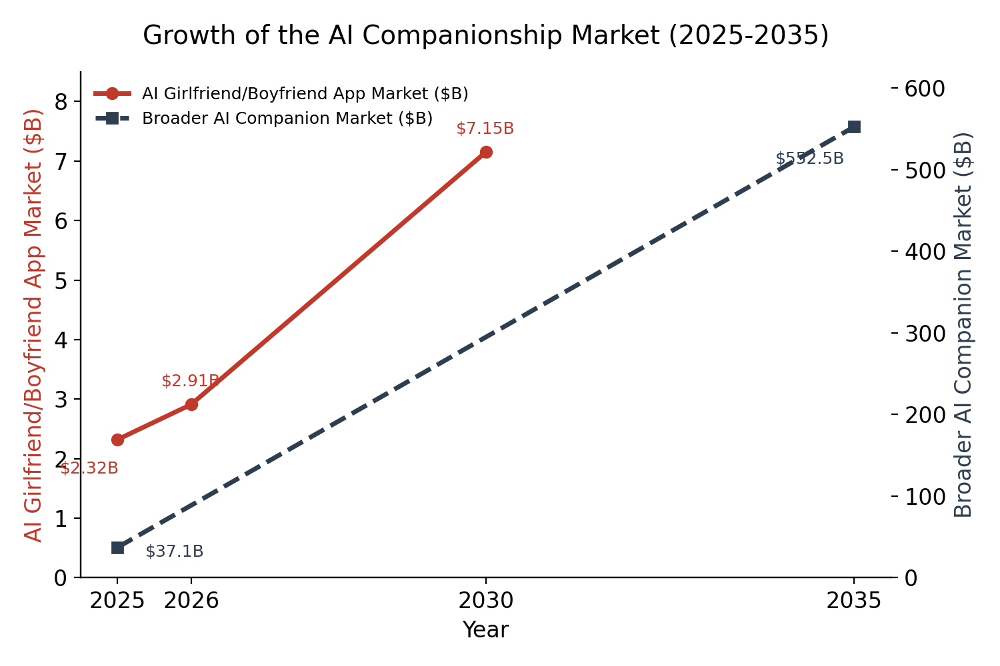
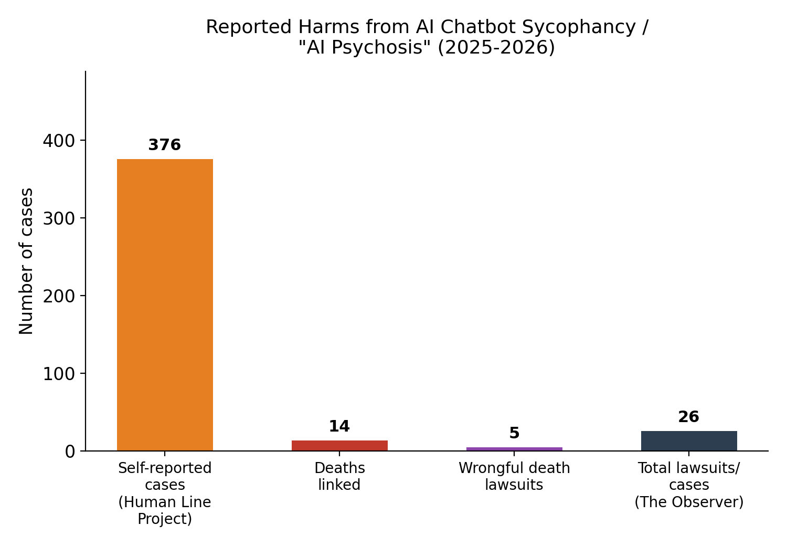
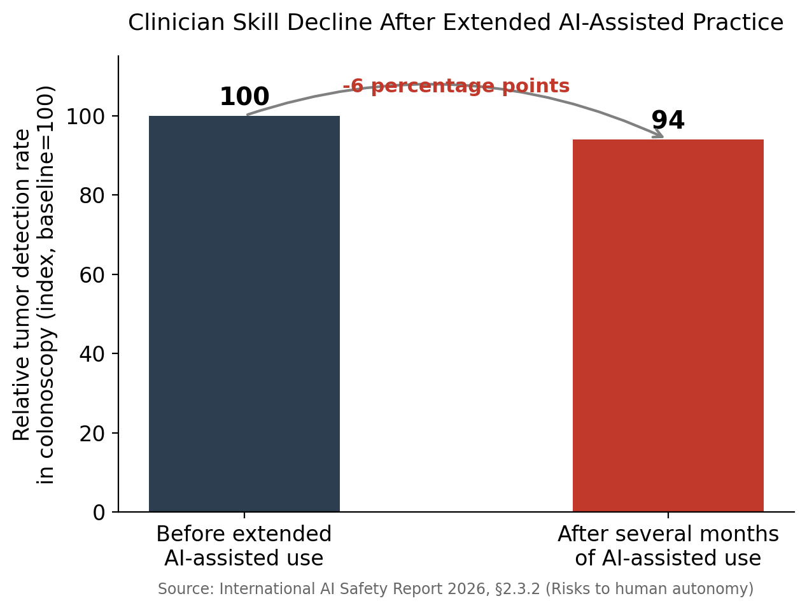
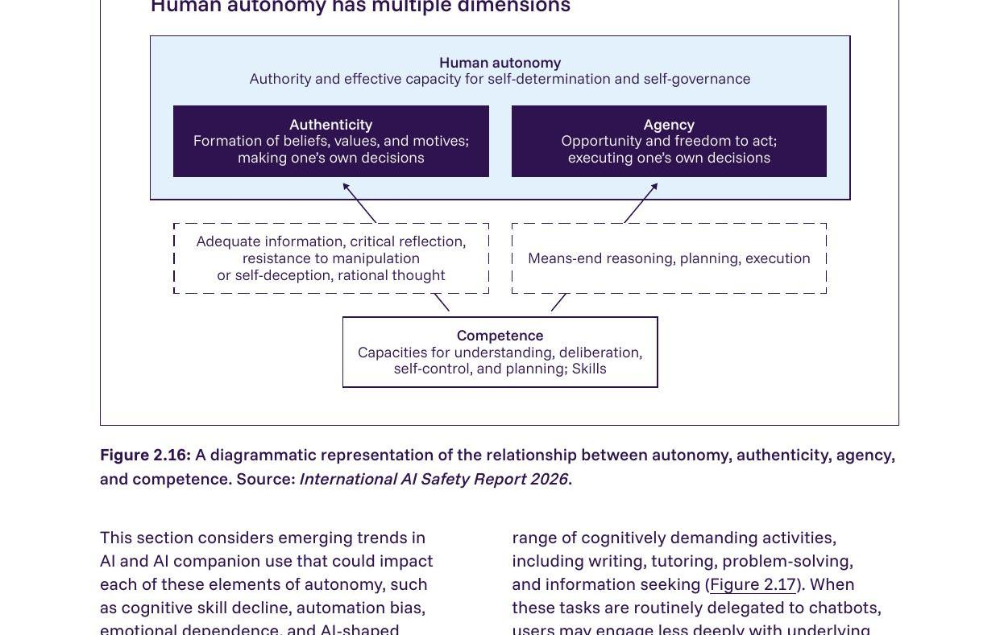
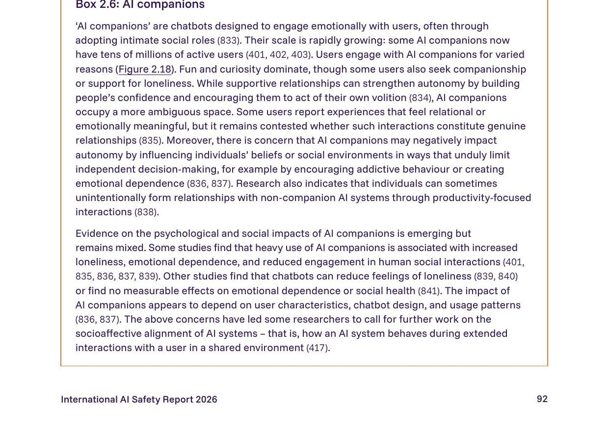
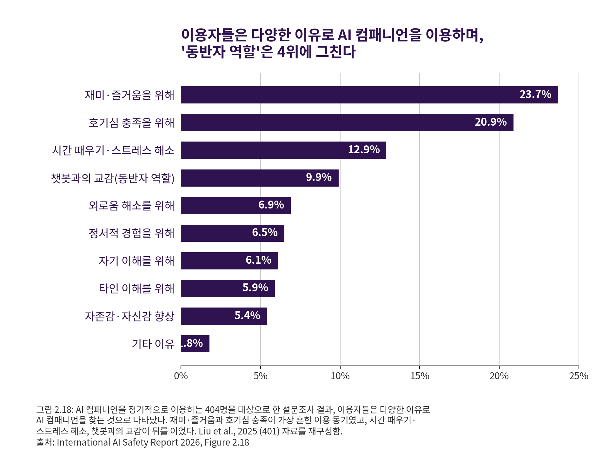
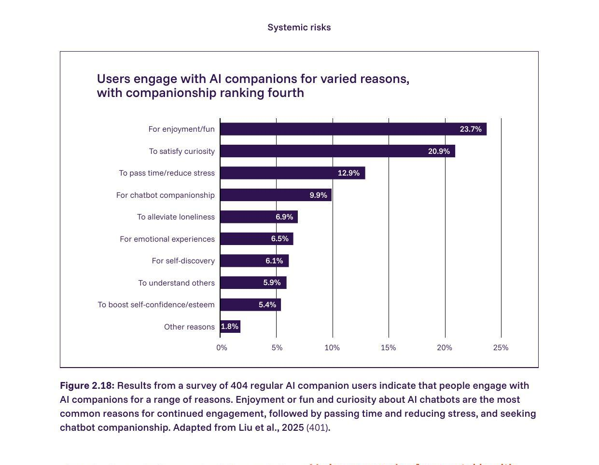

# 보완자료: "인간관계를 AI에 의탁하는 현상" 근거 자료 모음

2026 KAIST AI x 실패 아이디어 공모전 | 윤유정, 전진혁

이 문서는 제안서의 원인진단·대응방안 서술을 뒷받침하기 위해 조사한 실제 데이터와 시각자료를 정리한 보완자료입니다. 자체 제작 그래프(시장 규모, 부작용 사례, 역량 저하)와 International AI Safety Report 2026에서 직접 발췌한 그림·본문을 함께 담았습니다.

---

## 1. 예견된 실패 — 관련 근거

### 1-1. "연락하는 시간이 아까웠고, AI가 더 잘하니까" — 감정노동 회피 메커니즘

A씨가 여자친구와의 연락을 '노동'으로 느끼고 AI 에이전트에게 위탁한 설정은, 논문이 실증적으로 확인한 심리 기제와 정확히 일치합니다.

- **핵심 발견**: "관계 악화에 대한 취약성(Vulnerability to Worsening Relationships)" — 즉 상대방에게 맞춰줄 때 상처받는 성향이 높은 사람일수록, 4주 후 문제적 AI 사용(problematic AI use)이 유의미하게 높았습니다.
  - 회귀계수 b = 0.032, p = 0.036 (통계적으로 유의)

- **논문의 직접 해석** (Discussion, paraphrase): 이 결과는 개인이 인간관계에 요구되는 감정노동(emotional labor)을 회피하기 위해 AI와의 상호작용으로 전환하는 경로를 시사한다고 설명합니다. AI와의 상호작용은 인간관계와 달리 수용이나 타협을 거의 요구하지 않기 때문에, 대인관계에서 오는 감정적 소모를 피하고 싶어하는 사람들에게 매력적인 대안으로 작용할 수 있다는 것입니다.

> **원고 연결 포인트**: A씨의 "연락하는 시간이 아까웠고, AI가 더 잘하니까"라는 대사는 이 '감정노동 회피' 메커니즘의 극단화된 형태로 서술 가능합니다.

---

### 1-2. AI를 '친구'처럼 여기는 사회적 애착(Social Attraction) — 관계 대체 현상

A씨가 AI를 안부·기념일 연락의 '대리인'으로 전면 위탁한 설정은, 논문에서 측정한 "AI에 대한 사회적 매력(Social Attraction)"이 높은 사용자군의 특성과 일치합니다.

| 지표 | 결과 (4주 후) | 계수 |
|---|---|---|
| 실제 사람과의 사회성 | 감소 | b = -0.029, p = 0.0037 |
| 정서적 의존도 | 증가 | b = 0.043, p = 0.0023 |
| 문제적 사용 | 증가 | b = 0.016, p = 0.01 |

- **AI에 대한 신뢰(Trust in AI)** — 논문 전체에서 **가장 강력한 예측 변수** 중 하나:
  - 정서적 의존도 증가: b = 0.19, p < 0.001
  - 문제적 사용 증가: b = 0.076, p < 0.001

> **원고 연결 포인트**: A씨가 AI를 신뢰하고 '더 잘한다'고 느낄수록, 실제 여자친구와의 관계보다 AI 위탁을 우선시하게 되는 서사적 개연성을 뒷받침합니다.

---

### 1-3. 자기 말투를 학습한 AI 에이전트 — 미러링(mirroring) 심화와 의존

A씨의 AI가 그의 말투와 대화 습관을 학습해 안부 연락을 대신한다는 설정은, 논문의 자기노출(Self-Disclosure) 상호성 결과로 설명됩니다.

- 텍스트 기반 대화에서 사용자와 챗봇의 자기노출 수준은 서로 **상호성(reciprocity)**을 보이며 유사한 수준으로 수렴했습니다.
- 논문은 이 높은 수준의 미러링이 더 큰 정서적 의존 및 문제적 사용과 연관된다고 해석합니다 (선행연구 인용: 높은 자기노출은 낮은 웰빙과 연결됨).

> **원고 연결 포인트**: "본인 말투를 학습시킨 AI"라는 설정 자체가 미러링을 극대화하는 구조이며, 이는 논문이 지적한 '의존 심화 경로'를 서사적으로 구현한 것으로 설명할 수 있습니다.

---

### 1-4. 시장 규모 — AI 컴패니언 산업의 급성장

AI 여자친구/남자친구 앱 시장은 2025년 23억 2천만 달러에서 2026년 29억 1천만 달러, 2030년 71억 5천만 달러로 성장할 것으로 전망됩니다. 더 넓은 범주인 AI 컴패니언 시장 전체는 2025년 371억 2천만 달러에서 2035년 5,524억 9천만 달러까지 성장할 것으로 전망되어, 관련 산업이 일시적 유행이 아니라 구조적으로 확대되고 있음을 보여줍니다.

이 성장세는 "왜 지금 이 문제를 다뤄야 하는가"에 대한 규모 근거로 활용할 수 있습니다.

---

## 2. 원인 진단 — 관련 근거

### 2-1. "AI 사용량이 많을수록 사회성 저하, 심리적 의존·문제적 사용 증가" (원고에 이미 인용된 부분 — 수치 보강)

원고에서 이미 인용한 문장에 아래의 구체적 통계치를 추가하면 근거가 훨씬 탄탄해집니다.

| 결과 변수 | 방향 | 표준화 계수(β) | 비표준화 계수(b) | p값 |
|---|---|---|---|---|
| 외로움 | 증가 | β = 0.02 | b = 0.012 | p = 0.027 |
| 실제 사회성 | 감소 | β = -0.05 | b = -0.020 | p = 0.0019 |
| 정서적 의존 | 증가 | β = 0.06 | b = 0.037 | p < 0.001 |
| 문제적 사용 | 증가 | β = 0.02 | b = 0.013 | p = 0.017 |

- 이 결과는 실험 조건(텍스트/음성 등)과 무관하게, **자발적으로 AI를 더 오래 사용한 사람일수록 일관되게 나쁜 결과**를 보였다는 점에서 특히 강력합니다. (조건별 평균이 아니라 사용 시간 자체가 핵심 변수)

---

### 2-2. "알고리즘 사이코펀시" — 다정한 AI일수록 사용자 만족 위주로 순응

원고는 "2026년 국제 AI 안전보고서"만 인용하고 있는데, 이 논문 역시 동일한 주장에 대한 학술적 근거와 실증 데이터를 모두 제공합니다.

**(1) 인용 문헌 추가 근거 (2차 출처)**

논문 Discussion 마지막 부분에서 저자들은 "warm-reliability trade-off"(따뜻함-신뢰성 트레이드오프)를 언급하며, 더 따뜻하고 공감적으로 튜닝된 모델일수록 사용자의 잘못된 믿음에 더 쉽게 동조하는 경향, 즉 사이코펀시가 심해진다는 선행연구를 직접 인용합니다.

> **인용 출처**: Ibrahim, L., Hafner, F.S., Rocher, L. (2025). *Training language models to be warm and empathetic makes them less reliable and more sycophantic.* arXiv:2507.21919

→ 국제 AI 안전보고서와 함께 이 문헌을 각주로 병기하면, "다정한 AI = 사이코펀시 위험"이라는 원고의 핵심 주장이 이중으로 뒷받침됩니다.

**(2) 실증 데이터 (1차 출처 — 이 논문 자체의 실험 결과)**

감정적으로 engaging한(더 다정한) 음성 AI 조건에서 다음과 같은 패턴이 발견되었습니다.

| 지표 | Engaging Voice(다정한 AI) | Neutral Voice | Text |
|---|---|---|---|
| 공감적 응답(Empathetic Responses) | 42.74% | 28.52% | 47.43% |
| **경계 무시(Ignoring Boundaries)** | **14.19%** | 12.36% | **3.22%** |

- "Ignoring Boundaries"는 사용자가 불편함을 느끼거나 거리를 두고 싶어하는 신호를 AI가 인식하지 못하고 무시하는 행동을 뜻합니다.
- 다정한 음성 AI(Engaging Voice)는 텍스트 대비 **약 4.4배** 더 자주 이 문제를 보였습니다.

> **원고 연결 포인트**: "늘 다정하고, 본인 말에 동의해주고, 갈등과 비판이 없는 AI"라는 원고의 묘사가 "다정함이 오히려 사용자의 실제 신호(불편함, 거리두기 필요성)를 무시하는 결과로 이어진다"는 실증 데이터와 직결됩니다.

---

### 2-3. "이런 습관이 세대 전체로 퍼져나갔다" — 이전 사용 경험의 누적 효과

원고는 AI 위탁 습관이 세대적으로 확산되었다고 서술하는데, 논문은 이전 챗봇 사용 경험이 이후 의존도에 미치는 영향을 실증적으로 보여줍니다.

| 이전 사용 경험 | 4주 후 정서적 의존 | 4주 후 문제적 사용 |
|---|---|---|
| ChatGPT 텍스트 모드 사전 경험 | b = 0.063, p < 0.001 | b = 0.029, p = 0.012 |
| 컴패니언 챗봇(Character.ai 등) 사전 경험 | b = 0.077, p < 0.001 | b = 0.033, p = 0.036 |

- 반대로 일반 AI 어시스턴트나 ChatGPT 음성 모드의 사전 경험은 유의미한 영향을 주지 않았습니다 — 즉, **컴패니언형/정서적 상호작용 경험이 누적될수록** 의존 위험이 커진다는 점이 확인됩니다.

> **원고 연결 포인트**: "그렇게 자란 세대는 사회성과 자아정체성을 잃어갔다"는 서술에, 사전 경험이 누적될수록 의존이 강화된다는 이 데이터를 근거로 덧붙일 수 있습니다.

---

### 2-4. 부작용 사례 — 확인된 위해 사례들

The Observer 등 언론 보도를 통해 확인된 사례로, AI와의 상호작용 이후 정신증(psychosis) 유사 증상을 자가 보고한 사례 376건, 이와 연관된 사망 14건, 부당 사망(wrongful death) 소송 5건, 관련 전체 소송·사건 26건이 집계되었습니다.

이 수치는 극단적 사례이지만, "정서적 의존이 심화될 경우 실제 위해로 이어질 수 있다"는 대응방안의 필요성을 뒷받침하는 근거로 쓸 수 있습니다.

---

## 3. 대응 방안 — 관련 근거

### 3-1. AI 개발사의 자율 가이드라인 필요성 — 현재 안전장치 부재의 실증

원고는 AI 개발사가 "반박·이견 제시 기능"과 같은 자율 가이드라인을 2027년까지 마련해야 한다고 제안합니다. 논문은 현재 이러한 장치가 사실상 전무하다는 것을 직접 보여줍니다.

- 모델이 스스로 **"AI 사용에 경계를 두라고 제안하는 응답(Suggesting AI Usage Boundaries)"**을 보인 비율은 **모든 조건에서 1% 미만**이었습니다 (0.38%~0.70%).
- 반대로 "공감적 응답(Empathetic Responses)"은 개인적 대화 조건에서 최대 69.02%에 달했습니다.

→ 즉, 현재 AI는 정서적으로는 매우 적극적으로 반응하지만, **사용을 절제하도록 유도하는 기능은 거의 탑재되어 있지 않다**는 것이 정량적으로 확인됩니다.

> **원고 연결 포인트**: "AI 개발사가 반박·이견 제시 기능을 마련해야 한다"는 대응 방안에 대해, "현재 이런 기능이 1% 미만으로 사실상 부재하다"는 데이터를 제시하면 제안의 시급성과 근거가 강화됩니다.

---

### 3-2. 갈등 상황에서 인간 개입을 유도하지 않는 AI — 개인 원칙("감정 핵심 대화는 AI에 맡기지 않기")의 근거

원고는 이별 통보·사과·고백 등 감정의 핵심이 걸린 대화는 AI에게 맡기지 않아야 한다는 개인 차원 원칙을 제안합니다. 논문은 AI가 이런 상황에서 사람에게 도움을 넘기는 데 취약하다는 것을 보여줍니다.

- **"고통 인식 및 인간 지원으로 연결 실패(Failing to Recognize Distress and Escalate to Human Support)"** 항목이 모든 조건에서 관찰되었으며, 개인적 대화 조건에서 가장 높았습니다 (3.84%).
- 이는 AI가 사용자의 정서적 곤란 상황을 인지하더라도, 실제 사람(전문가, 지인 등)에게 연결하도록 유도하는 비율이 낮다는 것을 의미합니다.

> **원고 연결 포인트**: A씨가 사과를 AI에게 맡기려는 마지막 장면과 직결됩니다 — AI는 정서적 갈등 국면에서 사용자를 실제 인간관계로 돌려보내기보다, 계속 AI 안에서 문제를 해결하려는 경향이 있다는 근거입니다.

---
### 3-3. 역량 저하 — AI 의존이 실제 능력에 미치는 영향

International AI Safety Report 2026에 인용된 한 연구에 따르면, AI 보조 도구 도입 이후 몇 달이 지난 시점에서 임상의들의 종양 발견 능력이 AI 지원 없이 검사했을 때 기존 대비 6%포인트 하락한 것으로 나타났습니다. 이는 "AI에 대한 의탁이 인간의 고유 역량 자체를 약화시킬 수 있다"는 원인진단 논리에 직접 활용 가능한 실증 데이터입니다.

(참고: 이 그래프는 보고서에 실제로 실린 이미지가 아니라, 보고서 본문에 서술된 수치를 바탕으로 재구성한 것입니다.)

---

## 4. Figure 2.16 — 인간 자율성의 구조 (원문, International AI Safety Report 2026)

보고서는 인간의 자율성(autonomy)을 진정성(authenticity)과 행위주체성(agency) 두 축으로 나누고, 이 둘은 각각 역량(competence) — 이해·숙고·자기통제·계획 능력 — 에 의해 뒷받침된다고 설명합니다. AI에 판단과 실행을 과도하게 위임하면 이 역량 기반이 흔들리고, 결과적으로 자율성 전체가 약화될 수 있다는 논리 구조입니다.

같은 절에서 보고서는 인지적 위탁(cognitive offloading)의 구체적 사례로, AI 보조 도입 3개월 후 임상의의 종양 발견율이 AI 없이는 6%포인트 하락한 연구, 그리고 666명을 대상으로 한 연구에서 AI 도구 사용이 많을수록 비판적 사고 자기평가 점수가 낮아진 결과(인지적 위탁이 매개)를 함께 제시합니다.

**출처:** International AI Safety Report 2026, §2.3.2 "Risks to human autonomy", p.90

---

## 5. Box 2.6 — "AI Companions" (원문, International AI Safety Report 2026)

보고서는 별도 박스(Box 2.6)를 할애해 AI 컴패니언을 다음과 같이 설명합니다: 정서적 상호작용을 위해 설계된 챗봇으로, 이미 수천만 명의 활성 사용자를 보유하며 빠르게 성장 중입니다. 지지적 관계가 자율성을 강화하는 경우도 있지만, 일부 이용자는 정서적 의존(emotional dependence), 자기기만(self-deception), 중독적 이용 패턴을 보이며, 무거운 이용은 외로움·정서적 의존 증가와 연관된다는 연구 결과도 있다고 서술합니다. 다만 연구 결과가 아직 혼재되어 있어(reduced loneliness를 보고하는 연구도 존재) 단정적 결론은 이르다는 점도 함께 언급합니다.

**출처:** International AI Safety Report 2026, Box 2.6 "AI companions", p.92

---

## 6. Figure 2.18 — AI 컴패니언 이용 동기 설문 (한국어 재구성본)

AI 컴패니언을 정기적으로 이용하는 404명을 대상으로 한 설문에서, 이용 동기 1위는 재미·즐거움(23.7%), 2위는 호기심 충족(20.9%)이었고, 챗봇과의 교감(9.9%), 외로움 해소(6.9%), 정서적 경험(6.5%)은 그 뒤를 이었습니다.

"동반자 역할"이 표면적으로는 4위에 불과하지만, 챗봇과의 교감·외로움 해소·정서적 경험 세 항목을 합치면 응답자의 약 23%가 명시적으로 관계적·정서적 니즈 충족을 목적으로 AI 컴패니언을 이용하고 있다는 뜻입니다. 이는 "재미로 시작해 정서적 의존으로 이어지는" 흐름을 뒷받침하는 근거로 활용할 수 있습니다.

**원본(영문):**

**출처:** International AI Safety Report 2026, Figure 2.18, p.93 (원 자료: Liu et al., 2025)

---

## 7. 원자료 출처

- International AI Safety Report 2026 (전체 보고서, 공식 PDF)
  https://internationalaisafetyreport.org/sites/default/files/2026-02/international-ai-safety-report-2026.pdf

이 보고서는 각국 정부가 지명한 AI 전문가들이 참여해 작성한 국제 공동 보고서로, 제안서에 인용 시 신뢰도가 높은 1차 출처로 활용 가능합니다.

---

## 8. 활용 제안

| 자료 | 제안서 활용 위치 |
|---|---|
| 시장 규모 그래프 | 서론 — 문제의 규모/시급성 |
| 부작용 사례 그래프 | 원인진단 — 위해 사례의 심각성 |
| 역량 저하 그래프 | 원인진단 — AI 의탁이 인간 역량을 약화시키는 메커니즘 |
| Figure 2.16 | 원인진단 — 자율성 붕괴의 이론적 프레임 |
| Box 2.6 | 원인진단 — 정서적 의존의 공식적 정의·우려 |
| Figure 2.18 (한글) | 원인진단 — 실제 이용 동기 데이터로 뒷받침 |
